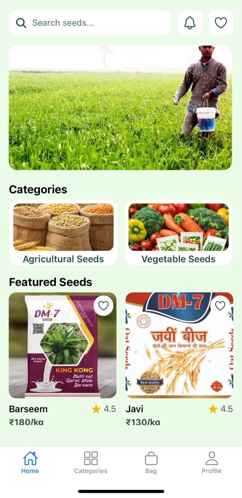
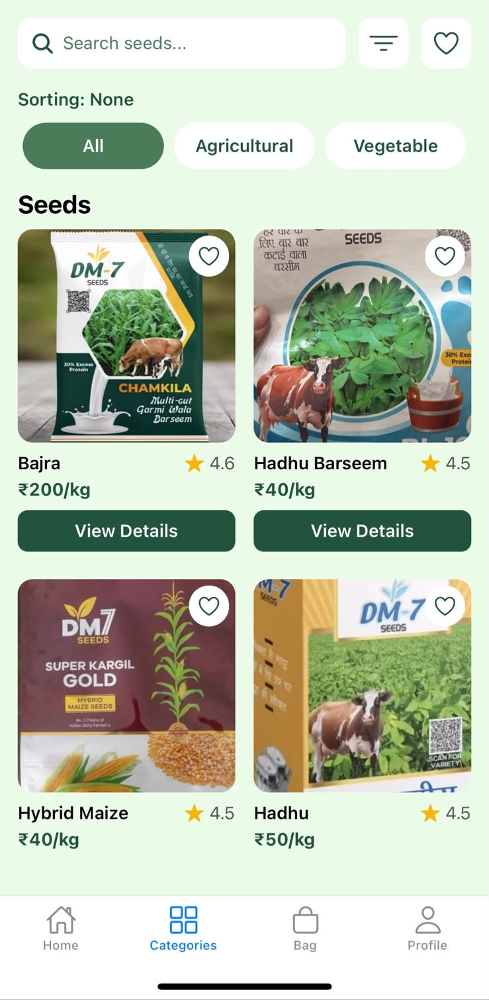
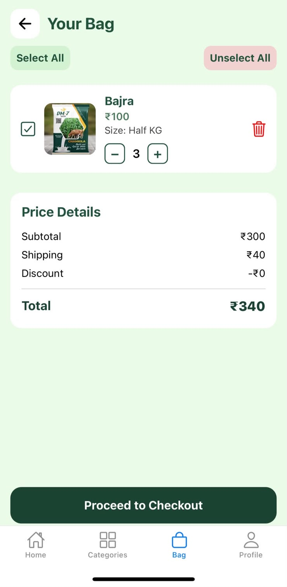
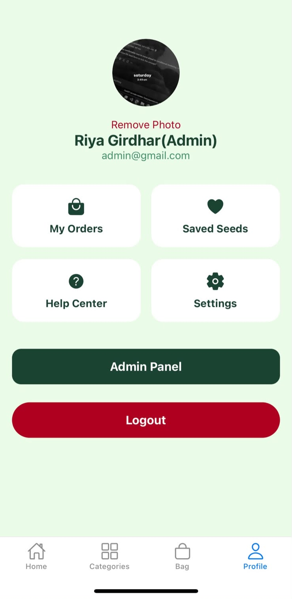
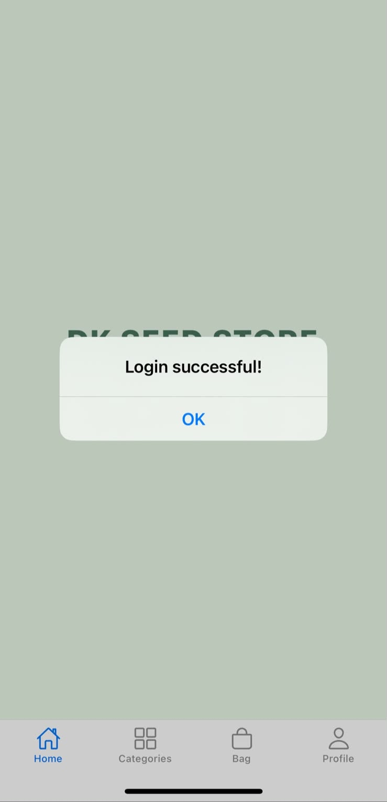
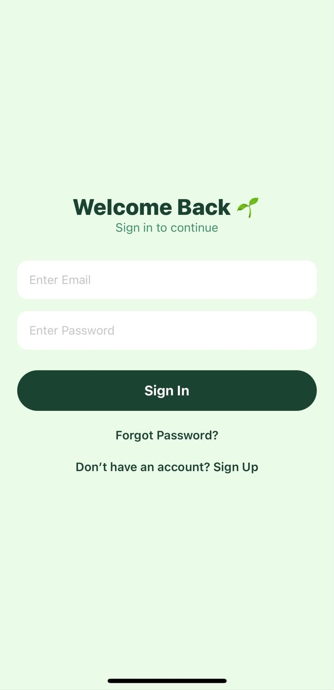
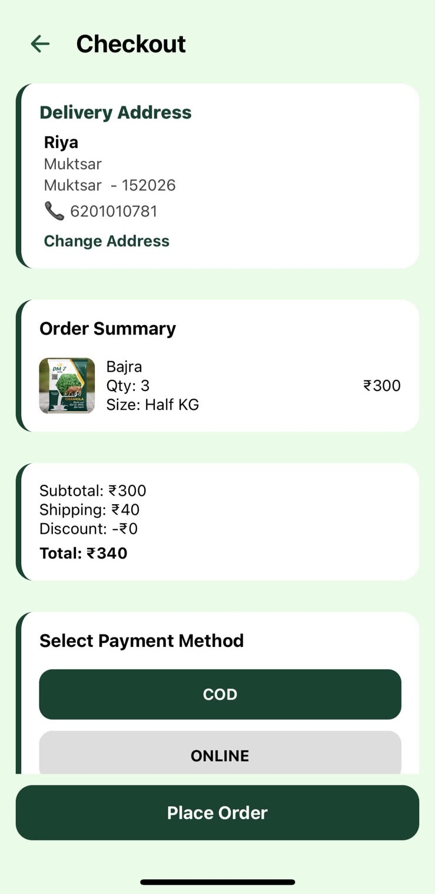
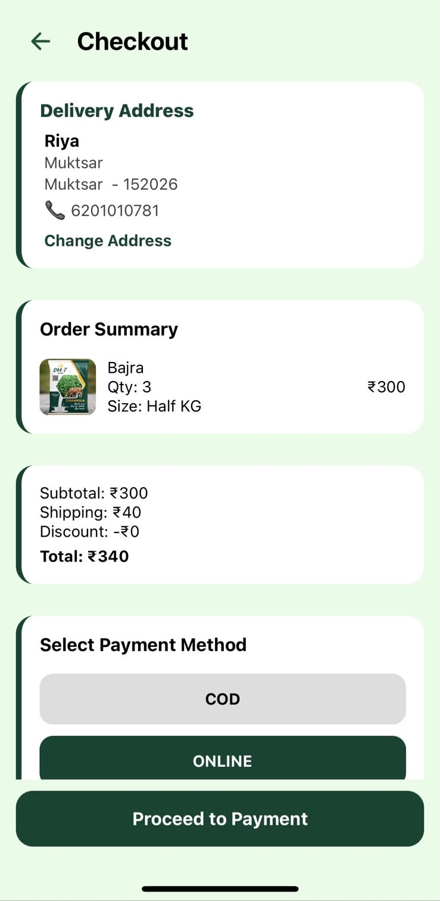
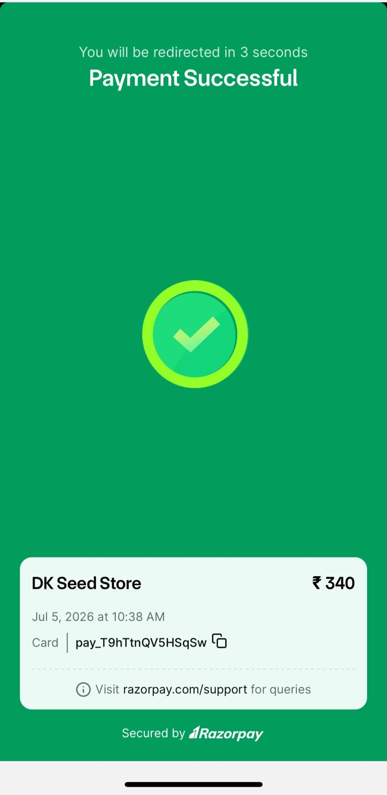
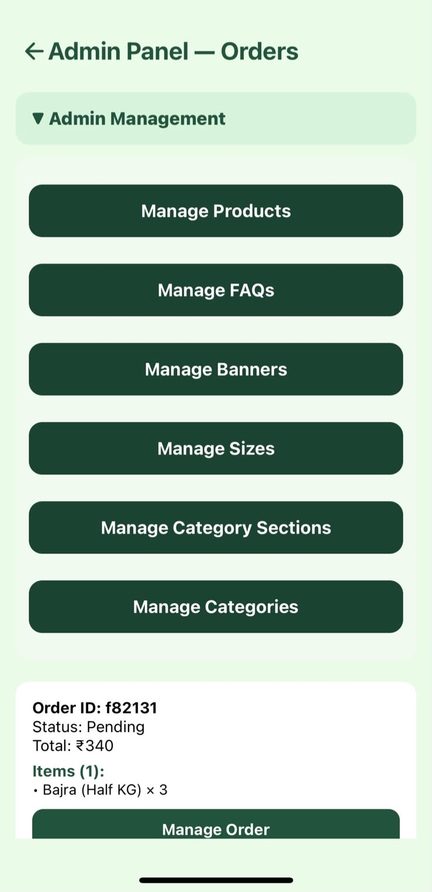

<p align="center">
  
</p>


<p align="center">


</p>

<h1 align="center">🌾 DK Seed Store</h1>

<p align="center">
A full-stack cross-platform agricultural e-commerce mobile application built with React Native (Expo), Node.js, Express.js, MongoDB Atlas, Cloudinary, and Razorpay.
</p>

<p align="center">
Browse • Cart • Wishlist • Orders • Razorpay • Cloudinary • Render
</p>

---

## 🚀 Project Highlights

- 📱 Cross-platform mobile application
- 🌐 Live backend deployed on Render
- ☁️ Cloudinary image management
- 💳 Razorpay payment integration
- 📦 Android APK & Play Store-ready AAB generated
- 🔐 Secure authentication & profile management

## 📖 Project Overview

DK Seed Store is designed to simplify agricultural seed shopping by providing a seamless digital shopping experience. Users can explore products, view detailed product information, add items to their cart or wishlist, manage delivery addresses, place orders, and complete secure online payments.

The frontend is developed using **React Native (Expo)**, while the backend is built with **Node.js**, **Express.js**, and **MongoDB Atlas**. Images are managed through **Cloudinary**, payments are integrated using **Razorpay**, and the backend is deployed on **Render**.

---

# ✨ Features

### 👤 User Features

- 🔐 Secure user authentication (Login & Signup)
- 👤 User profile management
- 👤 Admin profile management
- 📷 Profile photo upload
- 📍 Address management

### 🛍 Shopping Features

- 🌱 Browse agricultural seed products
- 🔍 Search and filter products
- 📄 View detailed product information
- 🛒 Add products to cart
- ❤️ Add products to wishlist
- 📦 Place and track orders

### 💳 Payment & Storage

- 💳 Secure online payments using Razorpay
- ☁️ Cloudinary image storage
- 📱 Responsive cross-platform mobile interface

### ⚙️ Backend Features

- 🌐 RESTful API architecture
- 🗄 MongoDB Atlas database integration
- 🚀 Live backend deployment on Render

---

# 📱 Preview

| Home | Categories |
|------|------------|
|  |  |

| Shopping Bag | Profile |
|--------------|---------|
|  |  |

| Login | Sign Up |
|-------|---------|
|  |  |

| Checkout | Place Order |
|----------|-------------|
|  |  |

| Payment Success | Admin Panel |
|-----------------|-------------|
|  |  |

---

# 🛠 Tech Stack

## 📱 Frontend

- React Native
- Expo
- Expo Router
- JavaScript
- Context API
- React Navigation

---

## ⚙️ Backend

- Node.js
- Express.js
- REST API

---

## 🗄 Database

- MongoDB Atlas
- Mongoose

---

## ☁ Cloud Services

- Cloudinary

---

## 💳 Payment Gateway

- Razorpay

---

## 🚀 Deployment

- Render (Backend)
- Expo EAS Build
- GitHub

---

# 📂 Project Structure

```
DK Seed Store
│
├── app
│   ├── (tabs)
│   ├── auth
│   ├── components
│   ├── utils
│   ├── index.jsx
│   ├── productDetails.jsx
│   ├── checkout.jsx
│   ├── payment.jsx
│   ├── myorders.jsx
│   ├── profile.jsx
│   └── ...
│
├── assets
│   ├── images
│   └── screenshots
│
├── components
├── constants
├── contexts
├── hooks
├── scripts
│
├── app.json
├── eas.json
├── package.json
├── package-lock.json
└── README.md
```

---

# 🚀 Installation

## Clone the repository

```bash
git clone https://github.com/RiyaGirdhar30/dk-seed-store-mobile-app.git
```

## Navigate to the project

```bash
cd dk-seed-store-mobile-app
```

## Install dependencies

```bash
npm install
```

## Start the Expo development server

```bash
npx expo start
```

---

# 🌐 Live Backend

The backend is deployed on **Render**.

**Backend API**

```
https://dk-seed-store-backend-1.onrender.com/
```

---

# 📦 Build Information

The application has been successfully built using **Expo EAS Build**.

### Android

- ✅ APK generated for testing and sharing
- ✅ AAB generated for Google Play Store deployment

### iOS

- 📱 Ready for future App Store deployment using Expo EAS Build

---

# 🔮 Future Enhancements

- ⭐ Product Reviews & Ratings
- ⭐ Push Notifications
- ⭐ Coupon & Discount System
- ⭐ Inventory Management
- ⭐ Sales Analytics Dashboard
- ⭐ Google Authentication
- ⭐ Apple Sign In
- ⭐ Multi-language Support

---

# 👩‍💻 Developer

**Riya Girdhar**

Bachelor of Engineering (Computer Science & Engineering)

Chandigarh University

GitHub: https://github.com/RiyaGirdhar30

LinkedIn: https://www.linkedin.com/in/riya-girdhar-a6074124a

---

## ⭐ If you found this project interesting, consider giving it a star!